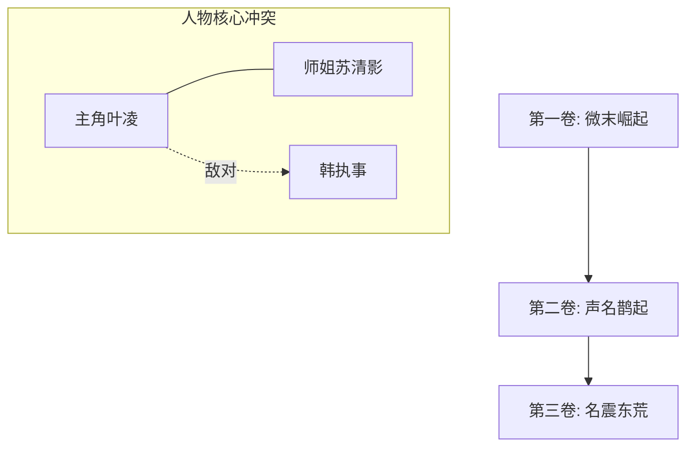

# 《灵气复苏的低调剑仙》小说总大纲

## Ⅰ. 核心风格与流派基调
* **题材流派**：cultivation (修真玄幻)
* **笔名作者**：天码笔仙
* **文风基调**：文风沉稳，细节丰富，人物智商在线，叙事干净利落，拒绝无意义灌水。

## Ⅱ. 世界观与势力网

## Ⅲ. 主线核心矛盾与终极追求
* **核心冲突**：(例：末法时代灵气衰微，大门派垄断资源。主角凭借神秘铁牌，低调逆袭，抗衡垄断势力。)
* **主角终极追求**：(例：解开师尊失踪之谜，重塑天地秩序，踏入神道。)

## Ⅳ. 境界等级体系规划
* **境界规划**：(例：练气期 -> 筑基期 -> 金丹期 -> 元婴期 -> 化神期)
* **战力界限约束**：每一境界差距犹如鸿沟，绝对严禁越级秒杀，突出招式妙用与法宝克制。
